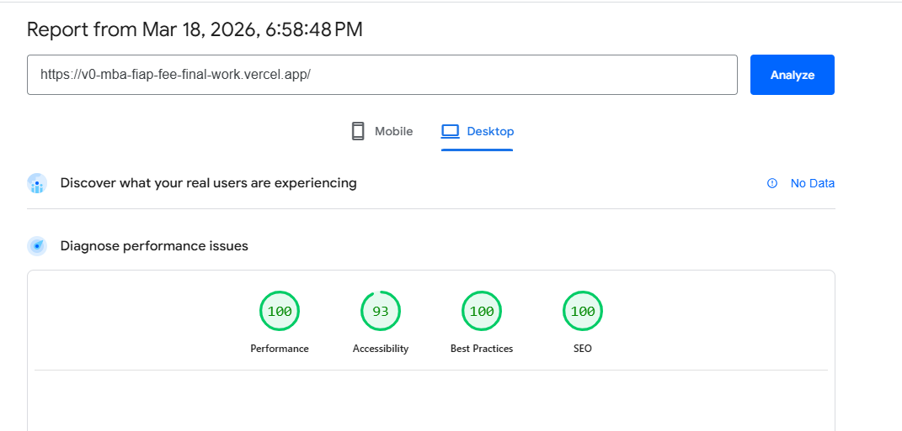
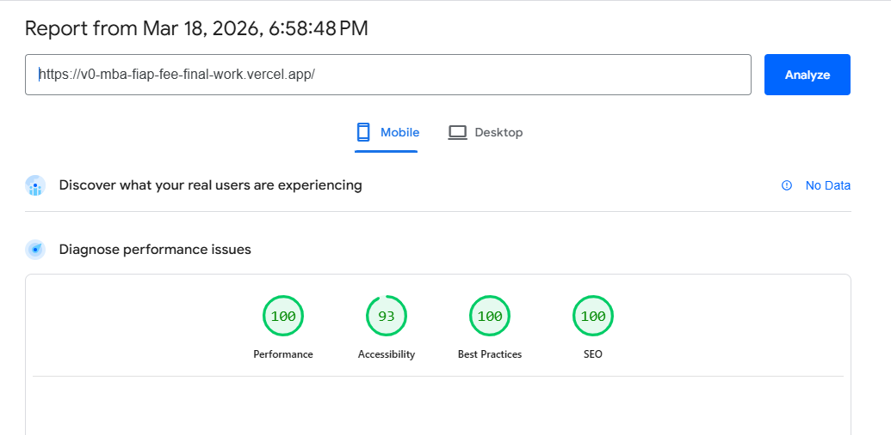
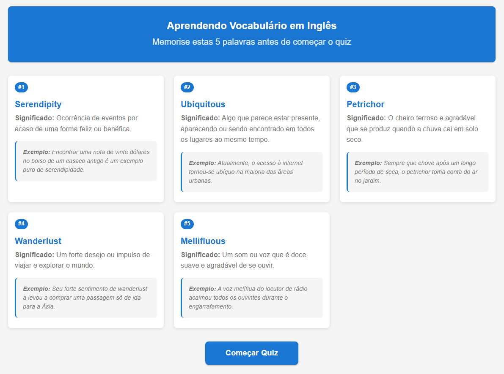
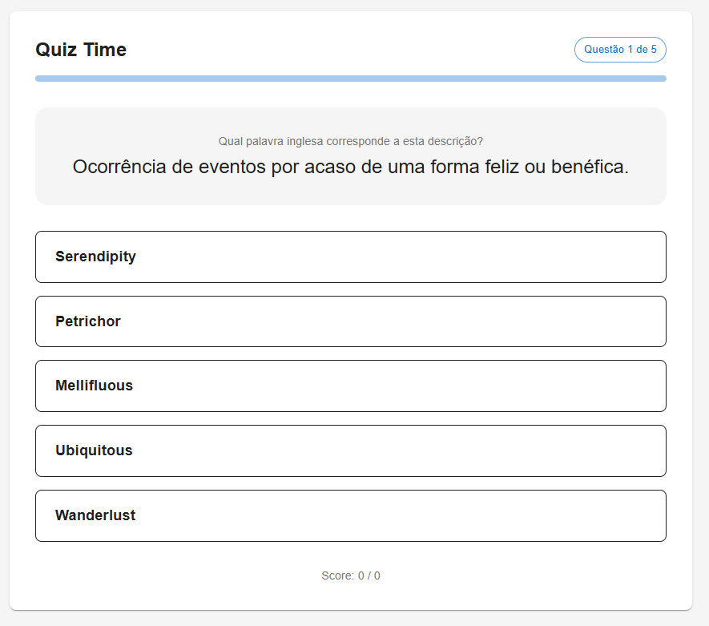
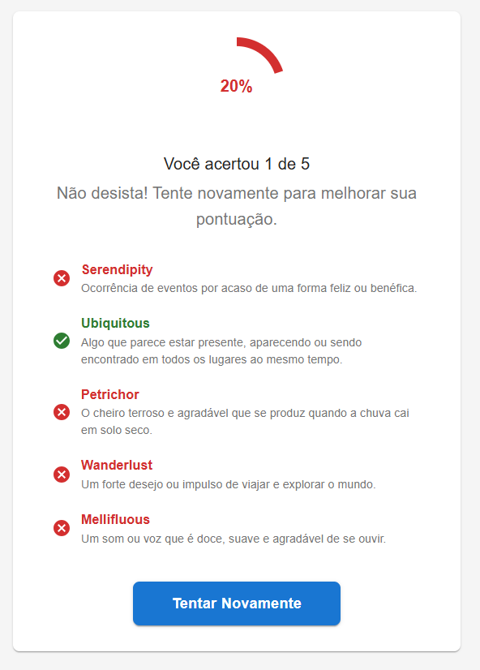
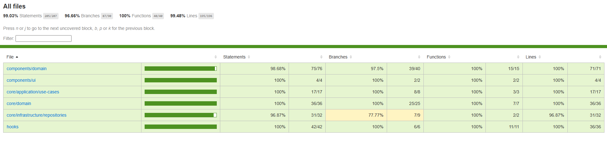

# English Vocabulary Learning

## Class

🎓 **MBA [FIAP](https://www.fiap.com.br/) Project** 📚 **Class:** FrontEnd Engineering  
👨‍🏫 **Professor:** Jaison Dairon Ebertz Schimidt  
👨‍🎓 **Author:** Anderson Costa - RM360522

## Links

🌐 **Site:** [Aprendendo Vocabulário em Inglês](https://v0-mba-fiap-fee-final-work.vercel.app/)  
⚙️ **API:** [Gerador de Palavras em Inglês com Gemini](https://v0-mba-fiap-fee-final-work.vercel.app/api/vocabulary)  
💻 **Desktop WebVitals:** [Page Speed Insights](https://v0-mba-fiap-fee-final-work.vercel.app/page-speed-insights-desktop/index.html)  
📱 **Mobile WebVitals:** [Page Speed Insights](https://v0-mba-fiap-fee-final-work.vercel.app/page-speed-insights-mobile/index.html)

## Github

🔗 **GitHub Repository:** [FrontEnd Engineering - Final Work](https://github.com/AsonCS/MBA-FIAP-FEE-Final_work)  
🧪 **Project Tests:** [Coverage Report](https://v0-mba-fiap-fee-final-work.vercel.app/coverage-report/index.html)

---

## 🛠️ Technologies Used


---

## 📖 About the Project

This web application is designed to help Brazilian speakers learn and memorize new English vocabulary. Using the power of **Google's Gemini AI**, the application dynamically generates a unique set of 5 English words per session, complete with their Portuguese descriptions and contextually relevant usage examples.

Users go through a **Memorization Phase** to study the words, followed by an interactive **Quiz Phase** to test their retention, ending with a final score evaluation.

The project is built with a strong emphasis on **Clean Architecture** and **Domain-Driven Design (DDD)** to ensure a scalable, highly testable, and decoupled codebase.

---

## 📊 Web Vitals

💻 [Page Speed Desktop Insights](https://v0-mba-fiap-fee-final-work.vercel.app/page-speed-insights-desktop/index.html)



📱 [Page Speed Mobile Insights](https://v0-mba-fiap-fee-final-work.vercel.app/page-speed-insights-mobile/index.html)



---

## 📸 Screenshots

### Memorization Phase



### Quiz Phase



### Results Display



---

## 📁 Project Documentation & Prompts

To maintain organization and context, all AI prompts and architectural documentation are kept in dedicated folders:

- 📂 **[`./prompts`](https://github.com/AsonCS/MBA-FIAP-FEE-Final_work/tree/main/docs/prompts)**: Contains the exact prompts and iterative instructions used with Vercel's v0 and Gemini to generate the UI components, business logic, and Spec Driven Development (SDD) files.

---

## 🚀 Getting Started

### Prerequisites

- Node.js (v18 or higher)
- A Google Gemini API Key

### Installation

1. Clone the repository:

```bash
git clone [https://github.com/AsonCS/MBA-FIAP-FEE-Final_work.git](https://github.com/AsonCS/MBA-FIAP-FEE-Final_work.git)
cd MBA-FIAP-FEE-Final_work
```

2. Install dependencies:

```bash
npm install
```

3. Set up your environment variables:

Create a `.env.local` file in the root directory and add your Gemini API key:

```env
GEMINI_API_KEY=your_api_key_here
```

4. Run the development server:

```bash
npm run dev
```

Open [http://localhost:3000](http://localhost:3000) with your browser to see the application.

## 🔧 Deploy

### Github Actions

[Action status](https://github.com/AsonCS/MBA-FIAP-FEE-Final_work/actions)
[Test Coverage Pipeline](https://github.com/AsonCS/MBA-FIAP-FEE-Final_work/blob/main/.github/workflows/test.yml)

### Github Coverage Report Artifact

[🧪 Coverage Report](https://v0-mba-fiap-fee-final-work.vercel.app/coverage-report/index.html)



### Deploy to Vercel

Manual deploy on Vercel from `main` branch.

---

## 🧪 Testing

This project targets >90% test coverage across Unit and UI tests.

To run the test suite:

```bash
npm run test
```

To view the coverage report:

```bash
npm run test -- --coverage
```
